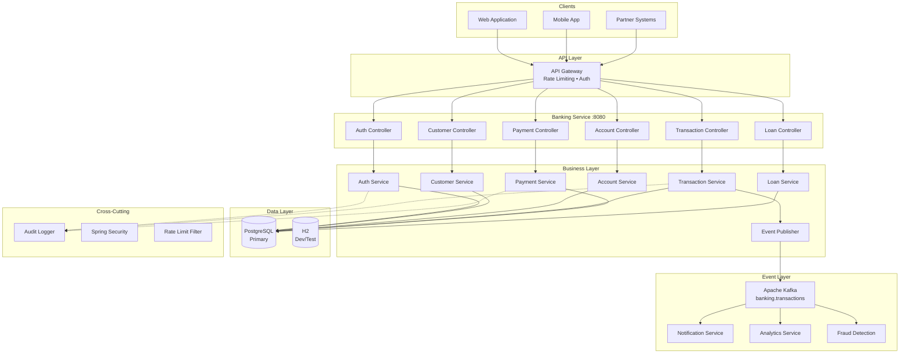

# Banking Financial API

[](https://openjdk.org/)
[](https://spring.io/projects/spring-boot)
[](https://kafka.apache.org/)
[](https://www.postgresql.org/)
[](Dockerfile)
[](LICENSE)
[](https://github.com/jzavalaq/banking-financial-api/actions/workflows/ci.yml)

> A production-grade banking and financial services API with multi-currency accounts, transactions, payments, loans, event-driven notifications via Kafka, and comprehensive audit logging.

**Live Demo:** _Coming soon_ | **Swagger UI:** _Coming soon_ | **Postman Collection:** [banking-financial-api.postman_collection.json](postman/banking-financial-api.postman_collection.json)

---

## Key Features

- **Customer Management**: Full KYC-compliant customer onboarding with identity verification
- **Account Operations**: Checking and savings accounts with overdraft protection
- **Financial Transactions**: Deposits, withdrawals, and inter-account transfers with ACID compliance
- **Event-Driven Notifications**: Real-time transaction events published to Apache Kafka for downstream consumers
- **Payment Processing**: Bill payments, scheduled payments, and payment cancellation
- **Loan Management**: Personal and business loan origination with approval workflow
- **JWT Authentication**: Secure token-based auth with refresh tokens and logout revocation
- **Rate Limiting**: Token bucket algorithm via Bucket4j for API protection
- **Audit Logging**: Immutable transaction trail for regulatory compliance

---

## Architecture



---

## Architectural Decisions

| Decision | Rationale |
|----------|-----------|
| **Layered Architecture** | Clear separation of concerns: Controller → Service → Repository |
| **Optimistic Locking** | `@Version` annotation prevents concurrent modification issues |
| **DTO Pattern** | Request/Response DTOs separate API contract from domain model |
| **Custom Exceptions** | Domain-specific exceptions (`InsufficientFundsException`, `ResourceNotFoundException`) |
| **Audit Trail** | Immutable audit logs for regulatory compliance (SOX, PCI-DSS) |
| **Token Blacklist** | JWT blacklist for secure logout and token revocation |
| **Flyway Migrations** | Version-controlled database schema evolution |
| **Event-Driven Design** | Kafka publishes transaction events for real-time notifications, analytics, and fraud detection |
| **Graceful Degradation** | Kafka optional in dev profile; events logged when Kafka unavailable |

---

## Tech Stack

| Technology | Version | Purpose |
|------------|---------|---------|
| Java | 21 | Runtime environment |
| Spring Boot | 3.2.5 | Application framework |
| Spring Security | 6.x | Authentication & authorization |
| Spring Data JPA | 3.x | Data persistence |
| Spring Kafka | 3.x | Event-driven messaging |
| Apache Kafka | 3.7+ | Event streaming platform |
| JWT (jjwt) | 0.12.5 | Token-based authentication |
| PostgreSQL | 15+ | Production database |
| H2 | 2.x | Development/testing database |
| Flyway | 10.13.0 | Database migrations |
| Bucket4j | 8.7.0 | Rate limiting |
| Lombok | Latest | Boilerplate reduction |
| SpringDoc OpenAPI | 2.5.0 | API documentation |
| OpenTelemetry | - | Distributed tracing |

---

## Quick Start

### Prerequisites

- Java 21 or higher
- Maven 3.9+
- Docker & Docker Compose (recommended)
- PostgreSQL 15+ (for production)

### Option 1: Docker Compose (Recommended)

```bash
# Clone the repository
git clone https://github.com/jzavalaq/banking-financial-api.git
cd banking-financial-api

# Copy environment file
cp .env.example .env

# Edit .env with your values (change JWT_SECRET and DB_PASSWORD)
nano .env

# Start all services
docker-compose up -d

# View logs
docker-compose logs -f app
```

Services available:
- **API:** http://localhost:8080
- **Swagger UI:** http://localhost:8080/swagger-ui.html
- **Health Check:** http://localhost:8080/actuator/health
- **PostgreSQL:** localhost:5432

### Option 2: Local Development (H2)

```bash
# Build the project
mvn clean package -DskipTests

# Run with dev profile (H2 in-memory database)
mvn spring-boot:run -Dspring-boot.run.profiles=dev

# H2 Console: http://localhost:8080/h2-console
# JDBC URL: jdbc:h2:mem:banking
# Username: sa | Password: (empty)
```

### Option 3: Local with PostgreSQL

```bash
# Set environment variables
export DB_URL=jdbc:postgresql://localhost:5432/banking
export DB_USERNAME=banking_user
export DB_PASSWORD=your_secure_password
export JWT_SECRET=your-256-bit-secret-key-minimum-32-characters

# Run with prod profile
mvn spring-boot:run -Dspring-boot.run.profiles=prod
```

---

## API Examples

### Authentication

```bash
# Register a new user
curl -X POST http://localhost:8080/api/v1/auth/register \
  -H "Content-Type: application/json" \
  -d '{
    "username": "johndoe",
    "password": "SecurePass123!",
    "email": "john@example.com"
  }'

# Login
curl -X POST http://localhost:8080/api/v1/auth/login \
  -H "Content-Type: application/json" \
  -d '{
    "username": "johndoe",
    "password": "SecurePass123!"
  }'

# Logout (revokes token)
curl -X POST http://localhost:8080/api/v1/auth/logout \
  -H "Authorization: Bearer <your-token>" \
  -H "Content-Type: application/json" \
  -d '{"refreshToken": "<your-refresh-token>"}'
```

### Accounts & Transactions

```bash
TOKEN="your-jwt-token"

# Create customer
curl -X POST http://localhost:8080/api/v1/customers \
  -H "Authorization: Bearer $TOKEN" \
  -H "Content-Type: application/json" \
  -d '{
    "firstName": "John",
    "lastName": "Doe",
    "email": "john.doe@example.com",
    "phone": "+1234567890",
    "dateOfBirth": "1990-01-15"
  }'

# Create account
curl -X POST http://localhost:8080/api/v1/accounts \
  -H "Authorization: Bearer $TOKEN" \
  -H "Content-Type: application/json" \
  -d '{
    "customerId": 1,
    "accountType": "CHECKING",
    "initialDeposit": 1000.00
  }'

# Transfer funds
curl -X POST http://localhost:8080/api/v1/transactions/transfer \
  -H "Authorization: Bearer $TOKEN" \
  -H "Content-Type: application/json" \
  -d '{
    "fromAccountNumber": "BA1234567890",
    "toAccountNumber": "BA0987654321",
    "amount": 150.00,
    "description": "Rent payment"
  }'
```

---

## Configuration

### Environment Variables

| Variable | Description | Default |
|----------|-------------|---------|
| `JWT_SECRET` | JWT signing key (256+ bits) | _Required in production_ |
| `DB_URL` | PostgreSQL connection URL | `jdbc:postgresql://localhost:5432/banking` |
| `DB_USERNAME` | Database username | `banking_user` |
| `DB_PASSWORD` | Database password | `banking_pass` |
| `ALLOWED_ORIGINS` | CORS allowed origins | `http://localhost:3000` |
| `KAFKA_ENABLED` | Enable Kafka event publishing | `true` (prod) / `false` (dev) |
| `KAFKA_BOOTSTRAP_SERVERS` | Kafka broker addresses | `localhost:9092` |

### Kafka Topic

Transaction events are published to the `banking.transactions` topic with the following structure:

```json
{
  "eventId": "550e8400-e29b-41d4-a716-446655440000",
  "eventType": "TRANSFER_OUT",
  "transactionReference": "TXN123456789ABC",
  "accountNumber": "BA1234567890",
  "relatedAccountNumber": "BA0987654321",
  "amount": 150.00,
  "balanceAfter": 850.00,
  "currency": "USD",
  "status": "COMPLETED",
  "description": "Rent payment",
  "timestamp": "2026-03-27T10:30:00Z",
  "customerId": 1
}
```

---

## Testing

```bash
# Run all tests
mvn test

# Run with coverage report
mvn test jacoco:report

# View coverage report
open target/site/jacoco/index.html
```

---

## Project Structure

```
src/main/java/com/banking/
├── config/          # Configuration classes (Security, CORS, JPA, Kafka)
├── controller/      # REST API endpoints
├── service/         # Business logic layer
├── repository/      # Data access layer
├── entity/          # JPA entities
├── dto/             # Request/Response DTOs
├── event/           # Kafka event classes (TransactionEvent)
├── exception/       # Custom exceptions
├── security/        # JWT authentication, rate limiting
└── audit/           # Audit logging
```

---

## License

This project is licensed under the MIT License - see the [LICENSE](LICENSE) file for details.

---

## Author

**Juan Zavala** - [GitHub](https://github.com/jzavalaq) - [LinkedIn](https://linkedin.com/in/juanzavalaq)
